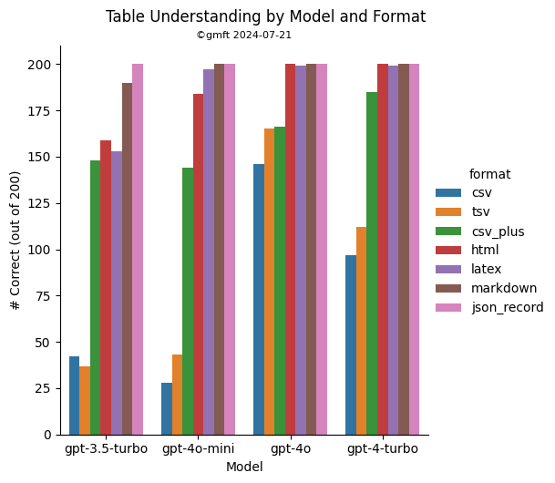
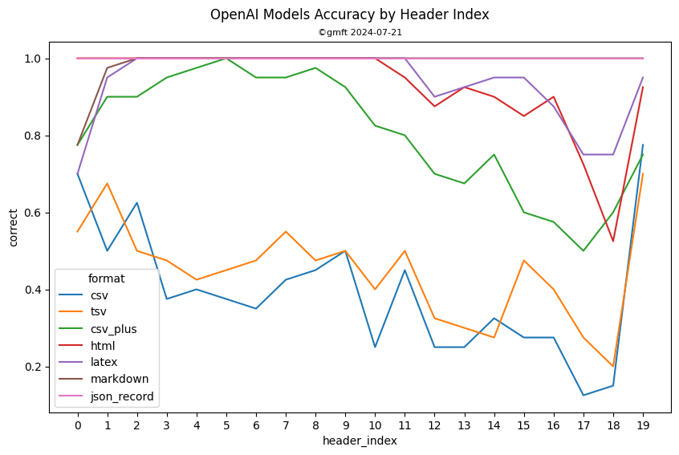
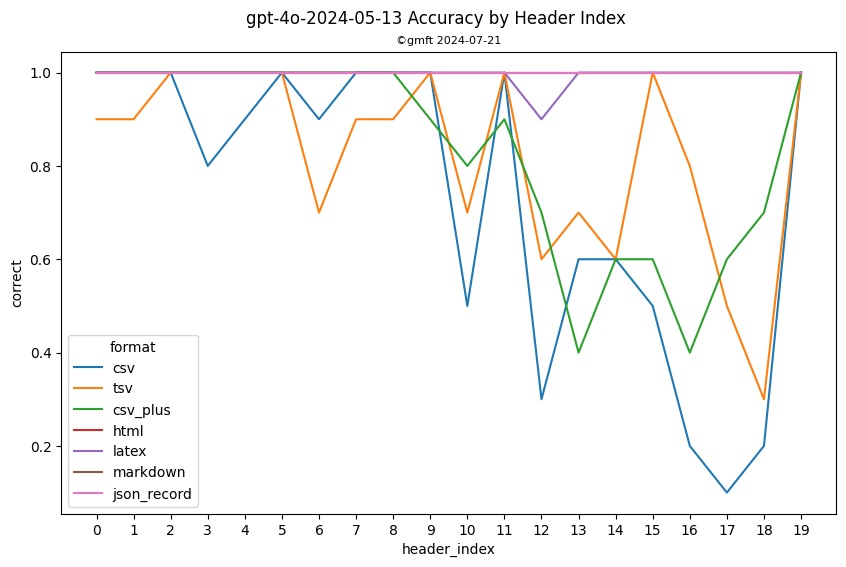

.. _rag:

Passing into LLMs
========================

Since processing tables takes a nontrivial amount of time, I recommend **converting all pdf documents into text files**
long before embedding them and passing them into LLMs.

Any text format can be used, but for the best performance, I recommend markdown or latex. 
For your convenience, an experimental method automatically
converts a pdf document into a format suitable for LLMs. The method `embed_tables` produces the pdf content interspersed with tables in markdown-like format.

Note that the presence of line breaks depends on a heuristic which works best with PyMuPDF. 
While line breaks have been ported to PyPDFium2Document, the approximation is imperfect. 
See the :ref:`mupdf` section for more information.

.. code-block:: python
    
    from gmft._rich_text.rich_page import embed_tables

    doc = PyMuPDFDocument("test/samples/7.pdf") # PyMuPDF is preferred
    
    # PyPdfium2 is possible, but line breaks may be less accurate
    # doc = PyPDFium2Document("path/to/pdf")
    
    rich_pages = embed_tables(doc=doc, tables=pdf7_tables)
    
    assert rich_pages[3].get_text().startswith("""Infectious of Alestig al. BMC Diseases Page 2011, 11:124 4 7 et
    http://www.biomedcentral.com/1471-2334/11/124
    Table and viral baseline with and without in patients Host 2 parameters treatment response
    |    |                                     | SVR n = 29           | non-SVR n = 21      | Univariate p value   |
    |---:|:------------------------------------|:---------------------|:--------------------|:---------------------|
    |  0 | Age (mean)                          | 45.2                 | 48.8                | 0.09a                |
    |  1 | Number of patients < 45 / > 45 yrs  | 11 / 18              | 4 / 17              | 0.21b                |
    |  2 | Gender (m/f)                        | 17 / 12              | 13 / 8              | 1.0b                 |
    |  3 | Baseline HCV RNA (mean log IU/mL)   | 6.37                 | 6.59                | 0.56a                |
    |  4 | Number with < 5.6 / > 5.6 log IU/mL | 8 / 21               | 0 / 21              | 0.01b                |
    |  5 | Genotype 1a/1b                      | 21 / 8               | 16 / 5              | 1.0b                 |
    |  6 | Fibrosis (F0/F1/F2/F3/F4)c          | 0 / 10 / 13 / 4 / 0  | 2 / 4 / 4 / 7 / 2   | 0.19d                |
    |  7 | Core aa 70                          | 28 R / 1 Q           | 15 R / 5 Q & 1 P    | 0.03b                |
    |  8 | Core aa 91                          | 21 C / 6 M / 2 L     | 16 C / 3 M / 2 L    | 0.82e                |
    |  9 | rs12979860                          | 16 CC / 13 CT / 0 TT | 2 CC / 11 CT / 8 TT | 0.0001e              |

    a Mann-Whitney U test.
    b Fisher’s exact test.
    c for Fibrosis scored according Ludwig and and available Batts, patients. 34 to was was
    d Logistic regression.
    e Chi test. square
    the correlation of responders Subgenotypes, and mutations strains, 8 7 treatment strong: core response was
    substitu\ufffetions The virologic associated with (R70) had and non-responders had glutamine 5 arginine not response was
    residue (Q70) (p 0.005). residue the However, 91. In in 37 70 at at contrast, asso\ufffeciated poor response was a =
    with substitutions of residue of the with infection, all the with One SVR 70: patients patients 1a 21 core
    (14%) (six with substitutions residue carried with while of the patients HCV non-SVR 70 7 R70, 15 16 at car\uffferied
    subtype 1b with and subtype with Q70 strains strain 1a R70. strains one
    P70) with""")

Example taken from the `corresponding internal test <https://github.com/conjuncts/gmft/blob/main/test/test_rich_page.py>`_.

Which format is best?
----------------------

For the simple task of matching a cell to its header, performance is (best to worst): 

    markdown ~ latex ~ json > html >> csv_plus* >> csv ~ tsv

(Only OpenAI models were tested. csv_plus is csv, but with an extra space after each comma. The improvement in performance might be attributable to better tokenization.)

